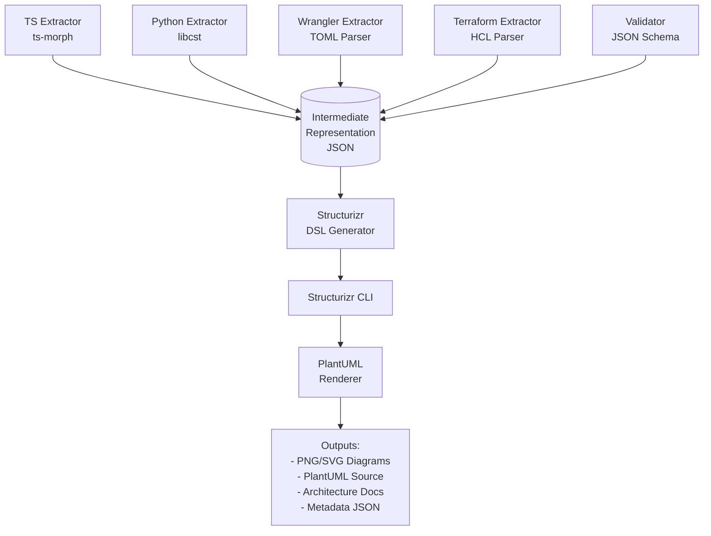

# ADR 0001 – Architecture as Code

**Status:** Accepted **Date:** 2025-10-05 (Updated: 2025-10-08) **Context:**
Polyglot microservices (TypeScript, Python) on Cloudflare Workers

---

## Problem

We need architecture documentation that actually stays current across multiple
languages and deployment platforms. Manual diagrams go stale. Separate modeling
tools drift from reality.

## Decision

Generate everything from the code itself using **Architecture as Code (AAC)**.

**How it works:**

1. Annotate code with structured comments (JSDoc/docstrings)
2. Extract IAC configuration (wrangler.toml, Terraform)
3. Run `npm run docs:arch` to generate:
   - C4 diagrams (system context, containers, components, deployment)
   - Per-service documentation
   - Infrastructure topology

**Pipeline:** Code + IAC → IR (JSON) → Structurizr DSL → PlantUML → PNG/SVG +
Docs

**Outputs live in:** `/docs/architecture`

---

## Annotation Standards

**For complete AAC annotation syntax, see:**
[AAC Style Guide](../reference/aac-style-guide.md)

### Quick Examples

Service metadata block:

```typescript
/**
 * @service gateway
 * @type cloudflare-worker-typescript
 * @layer api-gateway
 * @description Entry point for all API requests
 */
```

Endpoint annotations:

```typescript
/**
 * @endpoint POST /count
 * @authentication internal-jwt
 * @scope daycount:write
 */
```

Classes can be excluded from diagrams with `@exclude-from-diagram` (for DTOs,
utilities, generated code)

---

## How It Works

Extractors parse TypeScript (ts-morph), Python (libcst), and IAC configs
(wrangler.toml, Terraform) to produce a single **Intermediate Representation
(IR)** - a validated JSON file that captures services, relationships, and
deployment topology.

**Why IR?** Language-agnostic. Add a new language? Write an extractor. Want
different diagrams? Swap the generator.

**Extraction Pipeline:**



**Run the pipeline:**

```bash
npm run docs:arch            # Full pipeline
npm run docs:arch:extract    # Just extraction
npm run docs:arch:validate   # Just validation
npm run docs:arch:render     # Just rendering
```

**CI validates:**

- IR against JSON Schema
- Dependencies resolve (no circular deps, no broken references)
- Structurizr DSL generation succeeds
- Diagrams are in sync with code (fails if stale)

We use dependency-cruiser (TS) and import-linter (Python) to enforce
architectural rules at build time.

---

## What You Get

**C4 diagrams:**

- System context (external dependencies: Auth0, users, Cloudflare)
- Container (all Workers, Pages)
- Component (per-service class diagrams)
- Deployment (per environment: dev/staging/prod showing Workers, KV, R2, routes)

**Generated docs:**

- Service inventory with tech stacks
- Per-service details (endpoints, config, dependencies)
- Infrastructure topology (routes, bindings, custom domains)

**File structure:**

```
docs/architecture/
├── workspace.dsl             # Structurizr DSL
├── ir.json                   # Validated IR
├── diagrams/
│   ├── system-context.{puml,png,svg}
│   ├── container.{puml,png,svg}
│   ├── components/*.{puml,png}
│   └── deployment/{dev,staging,production}.{puml,png}
└── docs/
    ├── index.md
    ├── services.md
    └── components/*.md
```

Diagrams exclude classes marked `@exclude-from-diagram` (DTOs, utilities, etc).
All outputs are sorted deterministically to prevent diff churn.

---

## Why Structurizr DSL?

We considered direct C4-PlantUML (no structured model), manual Structurizr
workspaces (drift from code), and custom generators (maintenance burden).

**Structurizr wins because:**

- One DSL generates diagrams AND documentation
- Workspace exports to JSON for custom docs
- Industry standard C4 tooling
- Text-based (version control friendly)
- PlantUML renders anywhere (CLI, online, IDE)

**Our IR approach:**

- Polyglot-friendly (works across TS/Python/Java)
- Schema validation catches errors early
- Deterministic sorting prevents diff noise
- Fast CI (extract per-service, merge)

---

## Trade-offs

**Costs:**

- Setup time (extractors, pipeline, schema)
- Discipline needed to maintain annotations
- Slightly longer builds
- C4 conventions constrain flexibility

**Wins:**

- Diagrams always match reality (code + IAC)
- Single source of truth scales across languages
- Dependency violations caught at build time
- Deployment config visible per environment
- Trustworthy onboarding docs

---

## Appendix: IR Schema {#ir-schema}

Full schema and validation rules: `schemas/aac-ir.json`

The IR captures services, relationships, endpoints, deployment nodes, and
components in a language-agnostic JSON format. See the schema file for complete
structure definitions.
