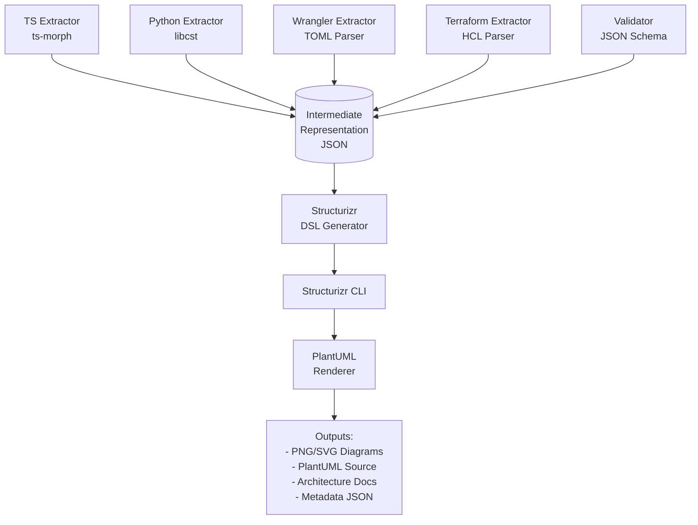

# ADR 0001 – Architecture as Code

**Status:** Accepted **Date:** 2025-10-05 (Updated: 2025-10-08) **Context:**
Polyglot microservices (TypeScript, Python) on Cloudflare Workers

---

## Problem

We need architecture documentation that actually stays current across multiple
languages and deployment platforms. Manual diagrams go stale. Separate modeling
tools drift from reality.

## Decision

Generate everything from the code itself using **Architecture as Code (AAC)**.

**How it works:**

1. Annotate code with structured comments (JSDoc/docstrings)
2. Extract IAC configuration (wrangler.toml, Terraform)
3. Run `npm run docs:arch` to generate:
   - C4 diagrams (system context, containers, components, deployment)
   - Per-service documentation
   - Infrastructure topology

**Pipeline:** Code + IAC → IR (JSON) → Structurizr DSL → PlantUML → PNG/SVG +
Docs

**Outputs live in:** `/docs/architecture`

---

## Annotation Standards

### Service-Level Metadata

Every service must have a metadata block at entry point:

```typescript
/**
 * @service gateway
 * @type cloudflare-worker
 * @layer api-gateway
 * @description Entry point for all API requests
 * @owner platform-team
 * @public-routes /api/*
 * @dependencies svc-daycount, svc-valuation
 * @security-model auth0-oidc
 * @sla-tier critical
 */
```

**Required Tags:**

- `@service` – unique identifier (kebab-case)
- `@type` – deployment type (cloudflare-worker | lambda | etc.)
- `@layer` – architectural layer (ui | api-gateway | business-logic |
  data-access)
- `@description` – one-line purpose

**Optional Tags:**

- `@owner`, `@public-routes`, `@internal-routes`, `@dependencies`
- `@security-model`, `@sla-tier`

### Endpoint Metadata

```typescript
/**
 * @endpoint POST /count
 * @gateway-route POST /api/daycount/v1/count
 * @authentication internal-jwt
 * @scope daycount:write
 * @rate-limit 100/min
 * @cacheable true
 * @cache-ttl 3600
 */
```

### Service Bindings

```typescript
/**
 * @service-binding SVC_DAYCOUNT
 * @target daycount
 * @purpose Calculate year fractions
 */
```

### Class Diagram Control

**Exclude classes from diagrams** to avoid clutter:

```typescript
/**
 * Simple DTO for bond details
 * @exclude-from-diagram
 */
class BondDetailsDTO {
  // ...
}
```

```python
"""Utility helper for date calculations.

@exclude-from-diagram
"""
class DateUtils:
    # ...
```

**When to exclude:**

- DTOs/POJOs with no business logic
- Simple utilities
- Generated code
- Framework boilerplate

**Default:** All classes included unless marked `@exclude-from-diagram`

---

## How It Works

**Extractors:**

| Source     | Tool          | What We Extract                                    |
| ---------- | ------------- | -------------------------------------------------- |
| TypeScript | `ts-morph`    | JSDoc, imports, decorators                         |
| Python     | `libcst`      | Docstrings, decorators, imports                    |
| Wrangler   | `@iarna/toml` | Service bindings, routes, KV/R2, env config        |
| Terraform  | `hcl2-parser` | Infrastructure resources, DNS, deployment topology |

All extractors output to a single **Intermediate Representation (IR)** - a JSON
file (`schemas/aac-ir.json`) that captures services, relationships, endpoints,
and deployment nodes. Think of it as a language-agnostic snapshot of your
architecture.

**Why IR?** Decouples extraction from rendering. Add a new language? Write an
extractor. Want a different diagram tool? Swap the generator.

**Extraction Pipeline:**



**Run the pipeline:**

```bash
npm run docs:arch            # Full pipeline
npm run docs:arch:extract    # Just extraction
npm run docs:arch:validate   # Just validation
npm run docs:arch:render     # Just rendering
```

**CI validates:**

- IR against JSON Schema
- Dependencies resolve (no circular deps, no broken references)
- Structurizr DSL generation succeeds
- Diagrams are in sync with code (fails if stale)

We use dependency-cruiser (TS) and import-linter (Python) to enforce
architectural rules at build time.

---

## What You Get

**C4 diagrams:**

- System context (external dependencies: Auth0, users, Cloudflare)
- Container (all Workers, Pages)
- Component (per-service class diagrams)
- Deployment (per environment: dev/staging/prod showing Workers, KV, R2, routes)

**Generated docs:**

- Service inventory with tech stacks
- Per-service details (endpoints, config, dependencies)
- Infrastructure topology (routes, bindings, custom domains)

**File structure:**

```
docs/architecture/
├── workspace.dsl             # Structurizr DSL
├── ir.json                   # Validated IR
├── diagrams/
│   ├── system-context.{puml,png,svg}
│   ├── container.{puml,png,svg}
│   ├── components/*.{puml,png}
│   └── deployment/{dev,staging,production}.{puml,png}
└── docs/
    ├── index.md
    ├── services.md
    └── components/*.md
```

Diagrams exclude classes marked `@exclude-from-diagram` (DTOs, utilities, etc).
All outputs are sorted deterministically to prevent diff churn.

---

## Why Structurizr DSL?

We considered direct C4-PlantUML (no structured model), manual Structurizr
workspaces (drift from code), and custom generators (maintenance burden).

**Structurizr wins because:**

- One DSL generates diagrams AND documentation
- Workspace exports to JSON for custom docs
- Industry standard C4 tooling
- Text-based (version control friendly)
- PlantUML renders anywhere (CLI, online, IDE)

**Our IR approach:**

- Polyglot-friendly (works across TS/Python/Java)
- Schema validation catches errors early
- Deterministic sorting prevents diff noise
- Fast CI (extract per-service, merge)

---

## Trade-offs

**Costs:**

- Setup time (extractors, pipeline, schema)
- Discipline needed to maintain annotations
- Slightly longer builds
- C4 conventions constrain flexibility

**Wins:**

- Diagrams always match reality (code + IAC)
- Single source of truth scales across languages
- Dependency violations caught at build time
- Deployment config visible per environment
- Trustworthy onboarding docs

---

## Appendix: IR Schema {#ir-schema}

Full schema: `schemas/aac-ir.json`

**Key structures:**

```typescript
// Service (Worker, Page, etc)
{
  id: string;                    // kebab-case
  name: string;
  type: "cloudflare-worker-typescript" | "cloudflare-worker-python" | ...;
  layer: "ui" | "api-gateway" | "business-logic" | "data-access";
  description: string;
  endpoints?: Endpoint[];
  configuration?: {
    environment: Array<{ name, required, description }>;
    bindings: Array<{ name, type, target }>;
  };
}

// Relationship (service-to-service)
{
  source: string;                // Service ID
  destination: string;           // Service ID
  protocol: "service-binding" | "https" | "grpc" | ...;
  authentication?: "internal-jwt" | "auth0-jwt" | ...;
  binding?: string;              // For Cloudflare service bindings
}

// DeploymentNode (per environment)
{
  id: string;
  name: string;
  type: "infrastructure" | "container";
  technology?: string;           // "Cloudflare Workers", "KV", "R2"
  properties?: {
    workerName, routes, customDomains,
    kvNamespaces: [{ binding, namespaceId }],
    r2Buckets: [{ binding, bucketName }],
    durableObjects: [{ binding, className }]
  };
  containerInstances?: string[]; // Service IDs running on this node
}

// Component (class/module for diagrams)
{
  id: string;
  type: "class" | "interface" | "module" | "function";
  excludeFromDiagram?: boolean;  // Default: false (opt-out)
}
```
