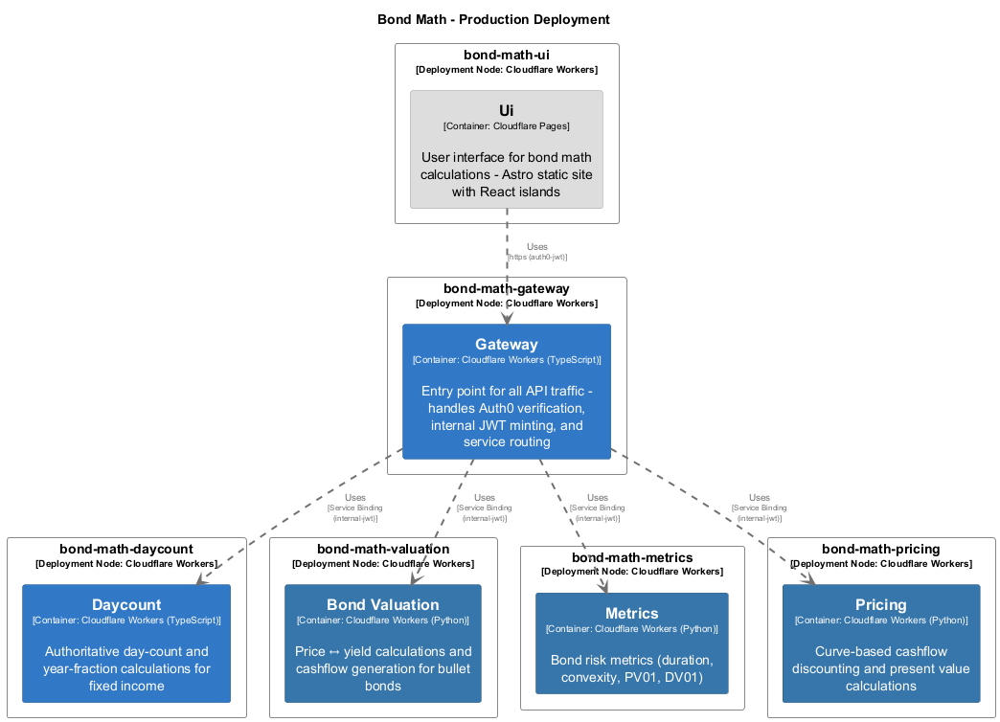

# Bond Valuation

> **Auto-generated from code** - Last updated: 2025-10-09

## Overview

**Service ID:** `bond-valuation` **Type:** cloudflare-worker-python **Layer:**
Business Logic

Price ↔ yield calculations and cashflow generation for bullet bonds

## Endpoints

### `POST /price`

**Configuration:**

- **Authentication:** internal-jwt
- **Scope:** valuation:write

### `POST /yield`

**Configuration:**

- **Authentication:** internal-jwt
- **Scope:** valuation:write

## Dependencies

### Incoming Dependencies

This service is used by:

- **Gateway**

## Components

This service contains 1 component(s):

### Component Diagram

High-level component relationships:

### Class Diagram

Detailed UML class diagram showing properties, methods, and relationships:

### Modules

#### main

Module: main

## Deployment

### Preview Environment

- **bond-math-valuation-preview** (Cloudflare Workers)

### Production Environment

- **bond-math-valuation** (Cloudflare Workers)

---

[← Back to Service Inventory](../services.md) |
[Architecture Overview](../index.md)
