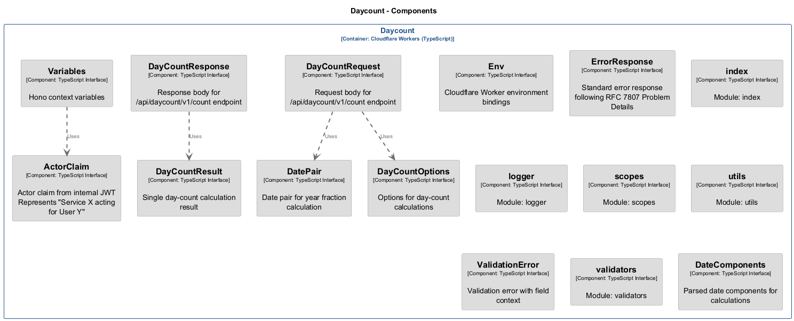
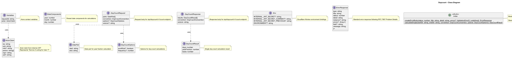

# Daycount

> **Auto-generated from code** - Last updated: 2025-10-10

## Overview

- **Service ID:** `daycount`
- **Type:** cloudflare-worker-typescript
- **Layer:** Business Logic

Authoritative day-count and year-fraction calculations for fixed income

## Dependencies

### Incoming Dependencies

This service is used by:

- **Gateway**

## Components

This service contains 16 component(s):

### Component Diagram

High-level component relationships:

### Class Diagram

Detailed UML class diagram showing properties, methods, and relationships:

### Interfaces

#### ActorClaim

Actor claim from internal JWT Represents "Service X acting for User Y"

#### DateComponents

Parsed date components for calculations

#### DatePair

Date pair for year fraction calculation

#### DayCountOptions

Options for day-count calculations

#### DayCountRequest

Request body for /api/daycount/v1/count endpoint

#### DayCountResponse

Response body for /api/daycount/v1/count endpoint

#### DayCountResult

Single day-count calculation result

#### Env

Cloudflare Worker environment bindings

#### ErrorResponse

Standard error response following RFC 7807 Problem Details

#### ValidationError

Validation error with field context

#### Variables

Hono context variables

### Modules

#### index

Module: index

#### logger

Module: logger

#### scopes

Module: scopes

#### utils

Module: utils

#### validators

Module: validators

---

[← Back to Service Inventory](../services.md) |
[Architecture Overview](../index.md)
