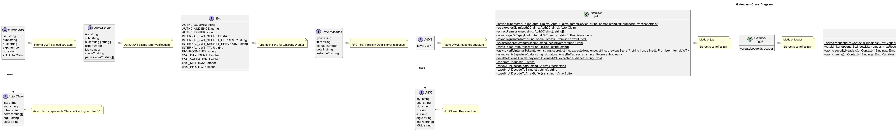
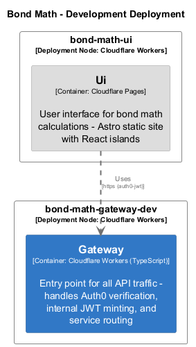

# Gateway

> **Auto-generated from code** - Last updated: 2025-10-09

## Overview

**Service ID:** `gateway` **Type:** cloudflare-worker-typescript **Layer:** Api
Gateway

Entry point for all API traffic - handles Auth0 verification, internal JWT
minting, and service routing

## Dependencies

### Outgoing Dependencies

This service depends on:

- **Bond Valuation**
  - Protocol: `service-binding`
  - Authentication: internal-jwt
  - Service Binding: `SVC_VALUATION`
- **Daycount**
  - Protocol: `service-binding`
  - Authentication: internal-jwt
  - Service Binding: `SVC_DAYCOUNT`
- **Metrics**
  - Protocol: `service-binding`
  - Authentication: internal-jwt
  - Service Binding: `SVC_METRICS`
- **Pricing**
  - Protocol: `service-binding`
  - Authentication: internal-jwt
  - Service Binding: `SVC_PRICING`

## Components

This service contains 9 component(s):

### Component Diagram

High-level component relationships:

### Class Diagram

Detailed UML class diagram showing properties, methods, and relationships:

### Interfaces

#### ActorClaim

Actor claim - represents "Service X acting for User Y"

#### Auth0Claims

Auth0 JWT claims (after verification)

#### Env

Type definitions for Gateway Worker

#### ErrorResponse

RFC 7807 Problem Details error response

#### InternalJWT

Internal JWT payload structure

#### JWK

JSON Web Key structure

#### JWKS

Auth0 JWKS response structure

#### ServiceRoute

Service route mapping

#### Variables

Hono context variables

## Deployment

### Development Environment

- **bond-math-gateway-dev** (Cloudflare Workers)

### Preview Environment

- **bond-math-gateway-preview** (Cloudflare Workers)

### Production Environment

- **bond-math-gateway** (Cloudflare Workers)

---

[← Back to Service Inventory](../services.md) |
[Architecture Overview](../index.md)
