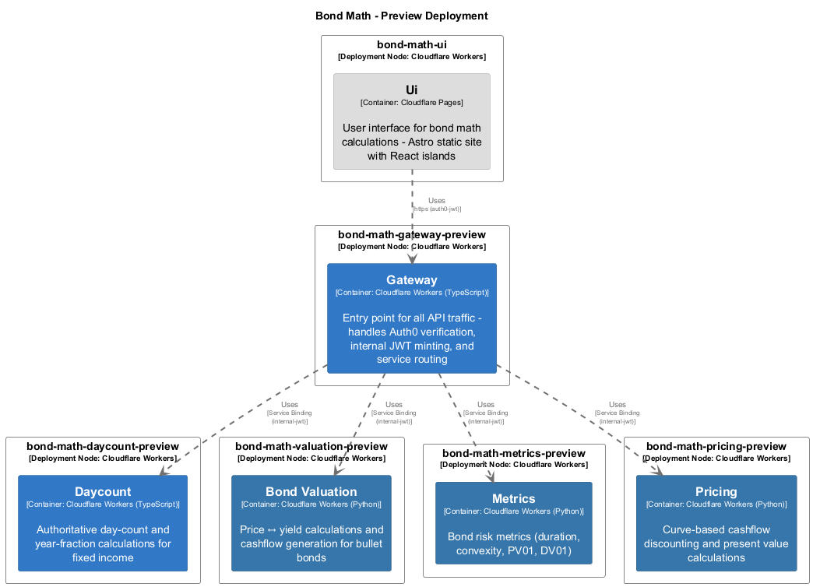

# Metrics

> **Auto-generated from code** - Last updated: 2025-10-09

## Overview

**Service ID:** `metrics` **Type:** cloudflare-worker-python **Layer:** Business
Logic

Bond risk metrics (duration, convexity, PV01, DV01)

## Endpoints

### `POST /duration`

**Configuration:**

- **Authentication:** internal-jwt
- **Scope:** metrics:write

### `POST /convexity`

**Configuration:**

- **Authentication:** internal-jwt
- **Scope:** metrics:write

### `POST /risk`

**Configuration:**

- **Authentication:** internal-jwt
- **Scope:** metrics:write

## Dependencies

### Incoming Dependencies

This service is used by:

- **Gateway**

## Deployment

### Preview Environment

- **bond-math-metrics-preview** (Cloudflare Workers)

### Production Environment

- **bond-math-metrics** (Cloudflare Workers)

---

[← Back to Service Inventory](../services.md) |
[Architecture Overview](../index.md)
