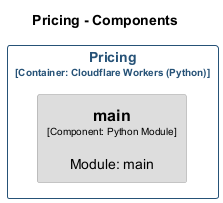

# Pricing

> **Auto-generated from code** - Last updated: 2025-10-12

## Overview

- **Service ID:** `pricing`
- **Type:** cloudflare-worker-python
- **Layer:** Business Logic

Curve-based cashflow discounting and present value calculations

## Endpoints

### `POST /value`

**Configuration:**

- **Authentication:** internal-jwt
- **Scope:** pricing:write

### `POST /scenario`

**Configuration:**

- **Authentication:** internal-jwt
- **Scope:** pricing:write

### `POST /key-rate`

**Configuration:**

- **Authentication:** internal-jwt
- **Scope:** pricing:write

## Dependencies

### Incoming Dependencies

This service is used by:

- **Gateway**

## Components

This service contains 1 component(s):

### Component Diagram

High-level component relationships:

### Class Diagram

Detailed UML class diagram showing properties, methods, and relationships:

### Modules

#### main

Module: main

---

[← Back to Service Inventory](../services.md) |
[Architecture Overview](../index.md)
