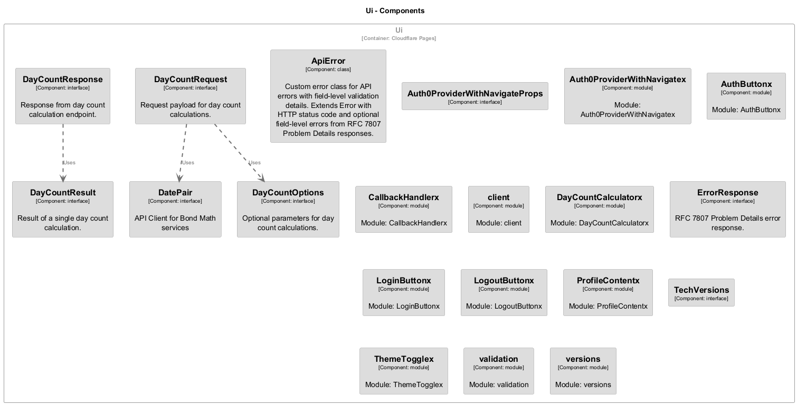

# Ui

> **Auto-generated from code** - Last updated: 2025-10-11

## Overview

- **Service ID:** `ui`
- **Type:** cloudflare-pages
- **Layer:** Ui

User interface for bond math calculations - Astro static site with React islands

## Endpoints

### `POST /api/daycount/v1/count`

**Configuration:**

- **Authentication:** auth0-oidc
- **Scope:** daycount:write
- **Cacheable:** No

## Dependencies

### Outgoing Dependencies

This service depends on:

- **Gateway**
  - Protocol: `https`
  - Authentication: auth0-jwt

## Components

This service contains 20 component(s):

### Component Diagram

High-level component relationships:

### Classs

#### ApiError

Custom error class for API errors with field-level validation details.

Extends Error with HTTP status code and optional field-level errors from RFC
7807 Problem Details responses.

### Interfaces

#### Auth0ProviderWithNavigateProps

#### DatePair

API Client for Bond Math services

#### DayCountOptions

Optional parameters for day count calculations.

#### DayCountRequest

Request payload for day count calculations.

#### DayCountResponse

Response from day count calculation endpoint.

#### DayCountResult

Result of a single day count calculation.

#### ErrorResponse

RFC 7807 Problem Details error response.

#### TechVersions

### Modules

#### Auth0ProviderWithNavigatex

Module: Auth0ProviderWithNavigatex

#### AuthButtonx

Module: AuthButtonx

#### CallbackHandlerx

Module: CallbackHandlerx

#### client

Module: client

#### DayCountCalculatorx

Module: DayCountCalculatorx

#### LoginButtonx

Module: LoginButtonx

#### LogoutButtonx

Module: LogoutButtonx

#### ProfileContentx

Module: ProfileContentx

#### ThemeTogglex

Module: ThemeTogglex

#### validation

Module: validation

#### versions

Module: versions

---

[← Back to Service Inventory](../services.md) |
[Architecture Overview](../index.md)
