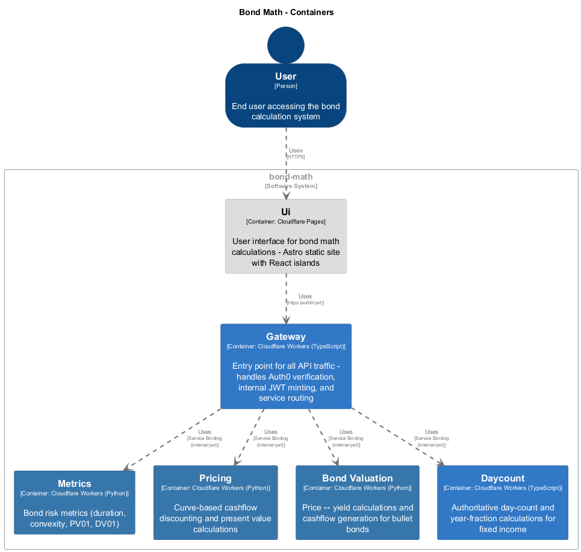
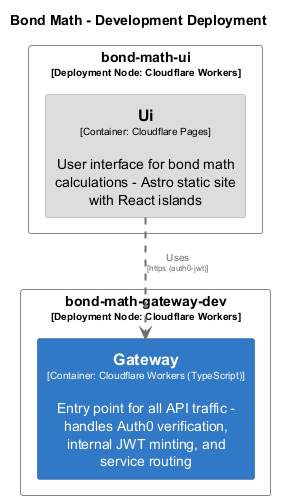

# Bond Math Architecture Documentation

> **Auto-generated from code** - Last updated: 2025-10-11

This documentation is automatically generated from code annotations and
infrastructure-as-code configuration using the Architecture as Code (AAC)
pipeline.

## Overview

Bond Math is a microservices-based fixed income calculation platform built on
Cloudflare Workers. The system provides:

- **Day count calculations** - Authoritative year fraction calculations for
  fixed income instruments
- **Bond valuation** - Price ↔ yield conversions and cashflow generation
- **Risk metrics** - Duration, convexity, PV01, DV01 calculations
- **Pricing** - Curve-based discounting and present value calculations

## Architecture

The system follows a microservices architecture with:

- **5 services** deployed as Cloudflare Workers (2 TypeScript, 3 Python)
- **4 service-to-service relationships** using service bindings
- **3 deployment environments** (development, preview, production)

## Services

### Api Gateway

- **[Gateway](./components/gateway.md)** (TypeScript) - Entry point for all API
  traffic - handles Auth0 verification, internal JWT minting, and service
  routing

### Business Logic

- **[Bond Valuation](./components/bond-valuation.md)** (Python) - Price ↔ yield
  calculations and cashflow generation for bullet bonds
- **[Daycount](./components/daycount.md)** (TypeScript) - Authoritative
  day-count and year-fraction calculations for fixed income
- **[Metrics](./components/metrics.md)** (Python) - Bond risk metrics (duration,
  convexity, PV01, DV01)
- **[Pricing](./components/pricing.md)** (Python) - Curve-based cashflow
  discounting and present value calculations

## Documentation

- **[Service Inventory](./services.md)** - Complete list of services with
  technical details
- **Component Details** - Per-service documentation:
  - [Bond Valuation](./components/bond-valuation.md)
  - [Daycount](./components/daycount.md)
  - [Gateway](./components/gateway.md)
  - [Metrics](./components/metrics.md)
  - [Pricing](./components/pricing.md)

## Diagrams

The following C4 diagrams are automatically generated:

### System Context

High-level view of the entire system


### Containers

All microservices and their relationships



### Deployment Diagrams

#### Development Environment



#### Preview Environment


#### Production Environment


## How This Was Generated

This documentation is generated using the **Architecture as Code** pipeline:

1. **Extract** - Parse JSDoc/docstrings from TypeScript and Python code
2. **Extract** - Parse infrastructure configuration from wrangler.toml files
3. **Validate** - Verify against JSON schema and check relationships
4. **Generate DSL** - Create Structurizr DSL workspace
5. **Render** - Generate PlantUML diagrams (PNG/SVG)
6. **Generate Docs** - Create this markdown documentation

To regenerate:

```bash
npm run docs:arch
```

See [ADR-0001](../../adr/0001-architecture-as-code.md) for details on the AAC
approach.
