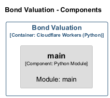
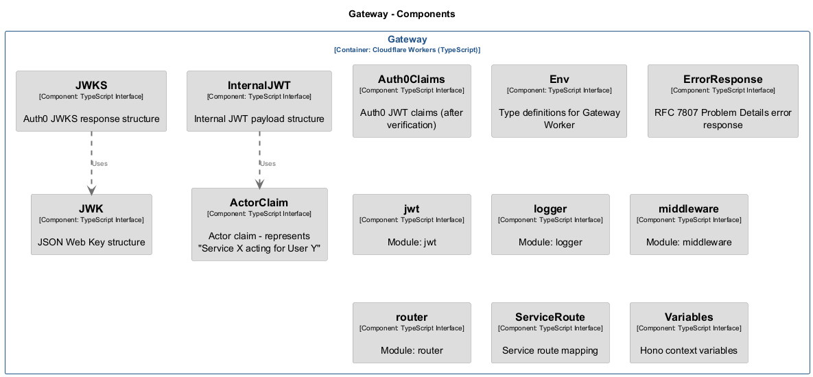
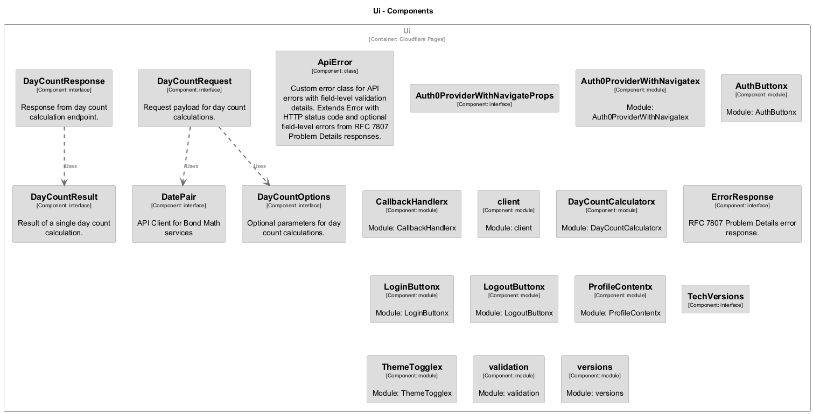

# Service Inventory

> **Auto-generated from code** - Last updated: 2025-10-11

Complete inventory of all services in the Bond Math architecture.

## Summary

| Service                           | Type             | Layer          | Description                                                                                             |
| --------------------------------- | ---------------- | -------------- | ------------------------------------------------------------------------------------------------------- |
| [Bond Valuation](#bond-valuation) | Python           | Business Logic | Price ↔ yield calculations and cashflow generation for bullet bonds                                    |
| [Daycount](#daycount)             | TypeScript       | Business Logic | Authoritative day-count and year-fraction calculations for fixed income                                 |
| [Gateway](#gateway)               | TypeScript       | Api Gateway    | Entry point for all API traffic - handles Auth0 verification, internal JWT minting, and service routing |
| [Metrics](#metrics)               | Python           | Business Logic | Bond risk metrics (duration, convexity, PV01, DV01)                                                     |
| [Pricing](#pricing)               | Python           | Business Logic | Curve-based cashflow discounting and present value calculations                                         |
| [Ui](#ui)                         | cloudflare-pages | Ui             | User interface for bond math calculations - Astro static site with React islands                        |

## Service Details

### Bond Valuation {#bond-valuation}

**ID:** `bond-valuation` **Type:** cloudflare-worker-python **Layer:** Business
Logic

Price ↔ yield calculations and cashflow generation for bullet bonds

**Endpoints:**

- `POST /price`
  - **Auth:** internal-jwt
- `POST /yield`
  - **Auth:** internal-jwt

**Used by (incoming):**

- Gateway

**Components:** 1

**[View detailed documentation →](./components/bond-valuation.md)**

### Daycount {#daycount}

**ID:** `daycount` **Type:** cloudflare-worker-typescript **Layer:** Business
Logic

Authoritative day-count and year-fraction calculations for fixed income

**Used by (incoming):**

- Gateway

**Components:** 16

**[View detailed documentation →](./components/daycount.md)**

### Gateway {#gateway}

**ID:** `gateway` **Type:** cloudflare-worker-typescript **Layer:** Api Gateway

Entry point for all API traffic - handles Auth0 verification, internal JWT
minting, and service routing

**Dependencies (outgoing):**

- Bond Valuation (`service-binding`, auth: internal-jwt)
- Daycount (`service-binding`, auth: internal-jwt)
- Metrics (`service-binding`, auth: internal-jwt)
- Pricing (`service-binding`, auth: internal-jwt)

**Used by (incoming):**

- Ui

**Components:** 13

**[View detailed documentation →](./components/gateway.md)**

### Metrics {#metrics}

**ID:** `metrics` **Type:** cloudflare-worker-python **Layer:** Business Logic

Bond risk metrics (duration, convexity, PV01, DV01)

**Endpoints:**

- `POST /duration`
  - **Auth:** internal-jwt
- `POST /convexity`
  - **Auth:** internal-jwt
- `POST /risk`
  - **Auth:** internal-jwt

**Used by (incoming):**

- Gateway

**Components:** 1

**[View detailed documentation →](./components/metrics.md)**

### Pricing {#pricing}

**ID:** `pricing` **Type:** cloudflare-worker-python **Layer:** Business Logic

Curve-based cashflow discounting and present value calculations

**Endpoints:**

- `POST /value`
  - **Auth:** internal-jwt
- `POST /scenario`
  - **Auth:** internal-jwt
- `POST /key-rate`
  - **Auth:** internal-jwt

**Used by (incoming):**

- Gateway

**Components:** 1

**[View detailed documentation →](./components/pricing.md)**

### Ui {#ui}

**ID:** `ui` **Type:** cloudflare-pages **Layer:** Ui

User interface for bond math calculations - Astro static site with React islands

**Endpoints:**

- `POST /api/daycount/v1/count`
  - **Auth:** auth0-oidc

**Dependencies (outgoing):**

- Gateway (`https`, auth: auth0-jwt)

**Components:** 20

**[View detailed documentation →](./components/ui.md)**
