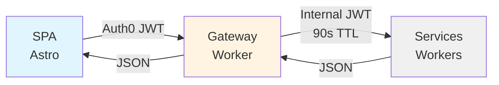
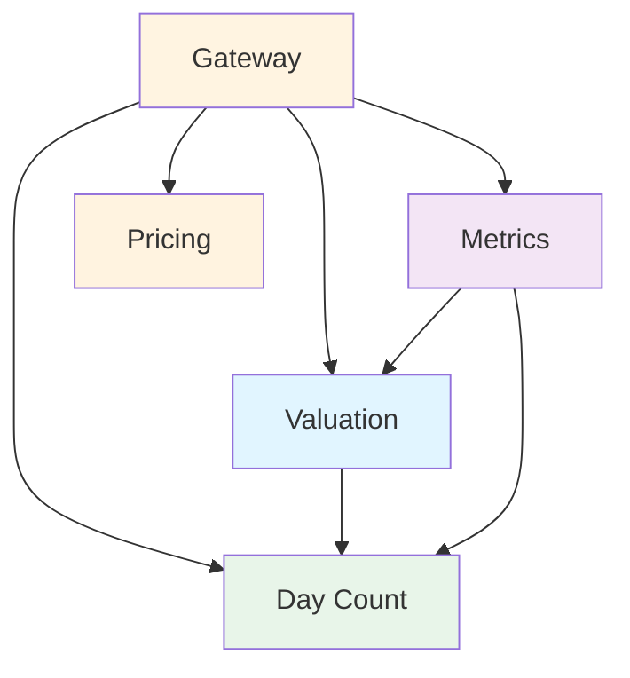

# Bond Math Request Flow

**How requests flow from user to service and back.**

---

## High-Level Architecture



**External:** Auth0 RS256 JWT (public/private keys) **Internal:** HMAC-SHA256
JWT (shared secret, 90s TTL)

---

## Request Flow Stages

### 1. User → Gateway

```
POST /api/valuation/v1/yield
Authorization: Bearer {Auth0-JWT}
Content-Type: application/json
```

### 2. Gateway Processing

**Middleware Chain:**

1. `requestId` - Generate UUID
2. `securityHeaders` - Add security headers
3. `timing` - Start timer
4. `logger` - Log request
5. `cors` - Handle CORS
6. `rateLimiter` - Check rate limit (100 req/min)

**Authentication:**

- Verify Auth0 JWT (RS256 via JWKS)
- Extract custom claims (role, permissions)

**Internal JWT Minting:**

- Sign with HMAC-SHA256
- 90 second TTL
- Include actor claim (user identity + permissions)

**Routing:**

- Match path prefix to service binding
- Forward with internal JWT

### 3. Service Processing

**Middleware:**

- `verifyInternalJWT` - Verify HMAC signature
- `requireScopes` - Check permissions

**Handler:**

- Access actor from context
- Execute business logic
- Return JSON response

### 4. Response Flow

**Service** → **Gateway** → **User**

**Added Headers:**

- `X-Request-ID` - Trace ID
- `X-RateLimit-*` - Rate limit info
- `Server-Timing` - Duration

---

## Service Dependencies



**Deployment Order:**

1. Day Count (no deps)
2. Valuation (→ Day Count)
3. Metrics (→ Valuation, Day Count)
4. Pricing (no deps)
5. Gateway (→ all)

---

## Request Examples

### Calculate Day Count

```bash
curl -X POST https://bondmath.chrislyons.dev/api/daycount/v1/count \
  -H "Authorization: Bearer ${AUTH0_TOKEN}" \
  -d '{"pairs":[{"start":"2025-01-01","end":"2025-07-01"}],"convention":"ACT_360"}'
```

**Internal Flow:**

1. Gateway verifies Auth0 token
2. Gateway → Day Count (internal JWT)
3. Day Count verifies + processes
4. Day Count → Gateway (result)
5. Gateway → User

### Calculate Yield (Service Chaining)

```bash
curl -X POST https://bondmath.chrislyons.dev/api/valuation/v1/yield \
  -H "Authorization: Bearer ${AUTH0_TOKEN}" \
  -d '{"bond":{...},"price":102.5}'
```

**Internal Flow:**

1. Gateway → Valuation
2. Valuation → Day Count (accrual calc)
3. Day Count → Valuation (result)
4. Valuation → Gateway (yield)
5. Gateway → User

---

## Error Handling

**RFC 7807 Problem Details:**

```json
{
  "type": "https://bondmath.chrislyons.dev/errors/unauthorized",
  "title": "Unauthorized",
  "status": 401,
  "detail": "Missing authentication token"
}
```

**Status Codes:**

- `401` - Missing/invalid auth
- `403` - Insufficient permissions
- `404` - Unknown route
- `429` - Rate limit exceeded
- `500` - Internal error

---

## Performance

**Latency Budget (p95):**

- Auth0 JWKS verification: < 50ms (cached)
- Internal JWT mint: < 5ms
- Service routing: < 10ms
- Service processing: < 100ms
- **Total:** < 200ms

**Rate Limits:**

- Free: 10 req/min
- Professional: 100 req/min
- Admin: 1000 req/min
- Service accounts: 500 req/min

---

## Security Model

**Zero-Trust:**

1. Every request verified cryptographically
2. No implicit trust between services
3. Short-lived credentials (90s)
4. Audience scoping per service
5. Actor traceability

**Token Lifecycle:**

```
Auth0 Token (1 hour)
  ↓
Gateway mints Internal JWT (90 seconds)
  ↓
Service verifies: signature + expiration + audience + permissions
```

---

## Related Documentation

- [Authentication Reference](../reference/authentication.md) - Setup and config
- [Authorization Model](./authorization-model.md) - Scopes and roles
- [ADR-0005: Zero-Trust Authorization](../adr/0005-zero-trust-authorization.md)
- [ADR-0006: Gateway Worker](../adr/0006-gateway-worker.md)
- [ADR-0011: Symmetric JWT](../adr/0011-symmetric-jwt-for-internal-auth.md)
- [ADR-0012: Scope-Based Authorization](../adr/0012-scope-based-authorization.md)
